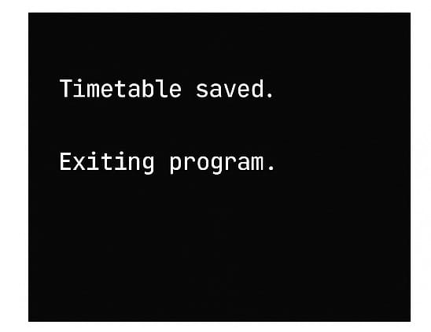

# <h1 align="center">University Timetable Management System</h1>

 ----

# **ABSTRACT**

A lightweight and user-friendly console-based timetable manager built in C.
This program allows students or administrators to easily create, view, and store a weekly university timetable.The system supports adding courses with details such as day, time, room, and professor, and stores all data in a file for future use. The program also loads the saved timetable automatically during startup, making it a persistent and easy-to-use scheduling tool.

## **Features of the Program**

* Add new courses with details (name, day, time, room, professor)
* Automatically store up to 100 courses
* Display timetable sorted by days of the week
* Save timetable to a file `(timetable.txt)`
* Load timetable automatically when the program starts
* Remove a course by entering its name
* Simple menu-driven interface
* Data is saved permanently even after program exit
 
## **Functional Requirements**

**1.Add New Courses**
* Enter course name, day, time, room, professor.
* Increase course count by 1.
  
**2.Display Weekly Timetable**
* Organized by days (Monday → Saturday).
* Shows course time, name, room, professor.

**3.Save Timetable to File**
* Saves all timetable data to a `timetable.txt` file.
* Stored in a readable format (each field on a new line).

**4.Load Timetable from File**
* Automatically loads previously saved timetable on program start.
* Allows the user to continue working without losing data.

**5.Remove Course**
* Search a course by name.
* Delete it by shifting the array.
* Automatically save changes.

**6.Exit**
* Saves the timetable and closes the program.

### **Technical Requirements**

**1.Software Requirements:**
* GCC compiler (MinGW / GCC / Linux GCC)
* Text editor (VS Code, Notepad++, CodeBlocks)
* Operating System: Windows / Linux / macOS

**2.Hardware Requirements:**
* Minimum 2 GB RAM
* Minimum 512 MB storage
* Any basic processor

**3.Programming Details:**
* Language: C
* File handling used for saving and loading data
* Uses:
      `stdio.h`
      `stdlib.h`
      `string.h`

### **How to Run the Program**

**1.Save the code:**

First, copy the entire C program code and save it in a file with the name:

```bash
timetable.c
```

Make sure the file extension is “.c”, which tells the compiler that it is a C source file.

**2.Compile the program:**

```bash
gcc timetable.c -o timetable
```

**3.Run the program**

for Windows:

```bash
timetable.exe
```

For Linux/macOS:

```bash
./timetable
```

### **ScreenShots**

**1.Main Menu**

<p align="center">

</p>

**2.Add Course**

<p align="center">

</p>

**3.display Timetable**

<p align="center">

</p>

**4.Saved timetable**

<p align="center">

</p>

**5.exit**

<p align="center">

</p>
